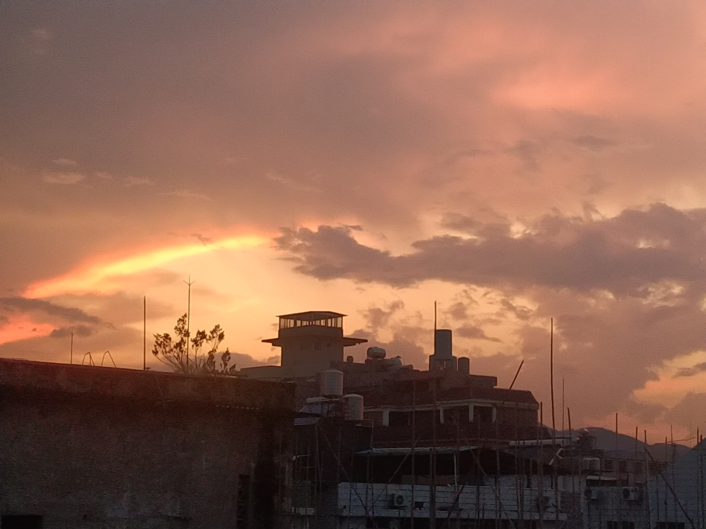
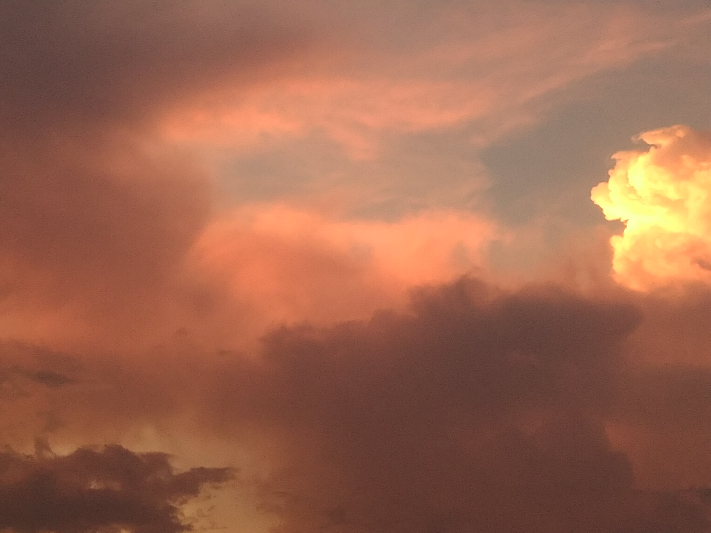
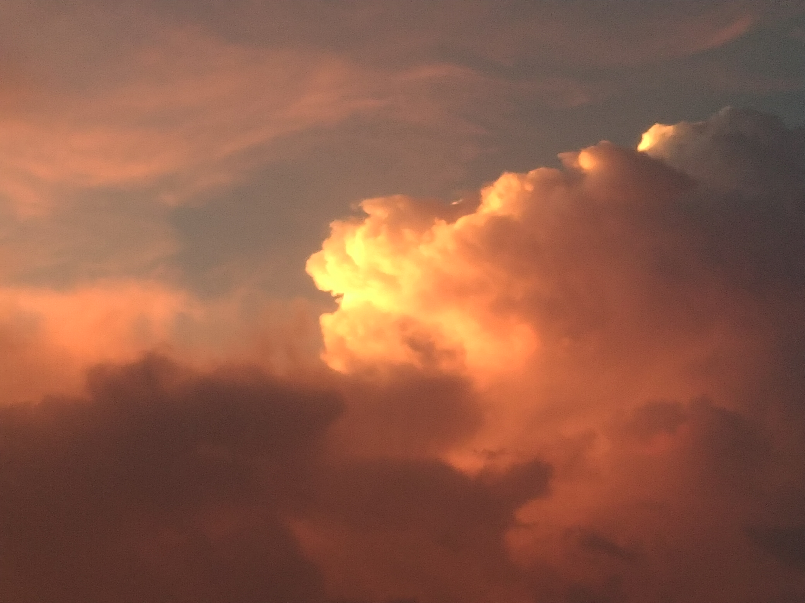
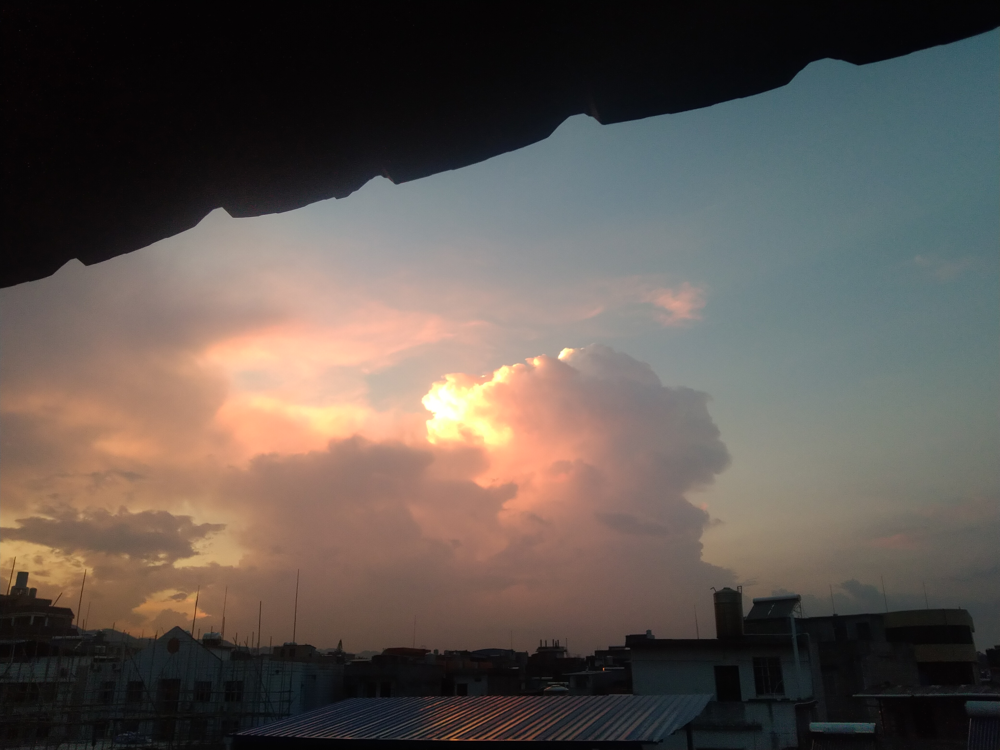
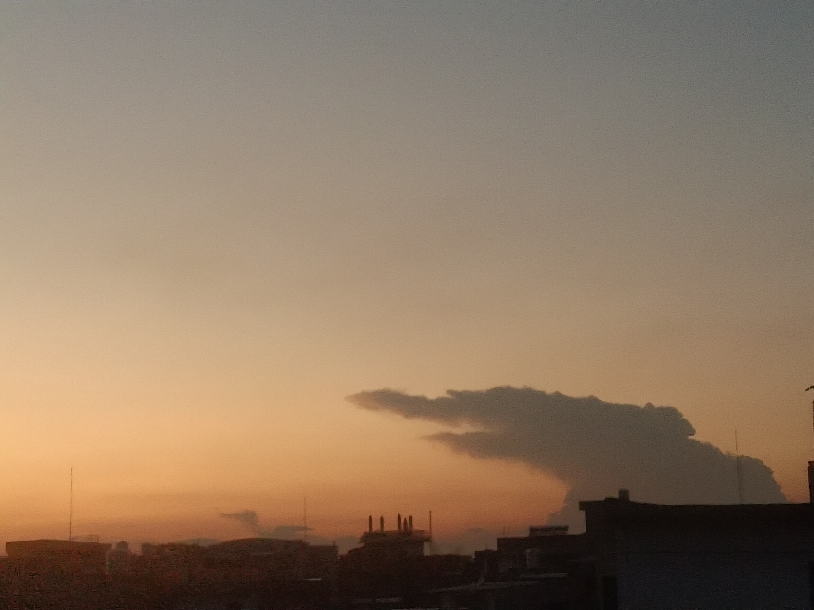

>浸透了烛光的葡萄酒，确实呈现出一种只属于梦境的晶莹的深红。
>
>“像死去的太阳。”罗辑说。
>
>“不要这样想啊，”她又露出那种让罗辑心动的真挚，“我觉得它像……晚霞的眼睛。”
>
>“你怎么不说是朝霞的眼睛？”
>
>“我更喜欢晚霞。”
>
>“为什么？”
>
>“晚霞消失后可以看星星，朝霞消失后，就只剩下……”
>
>“只剩下光天化日的现实了。”
>
>“是，是啊。”
>——《三体：黑暗森林》

